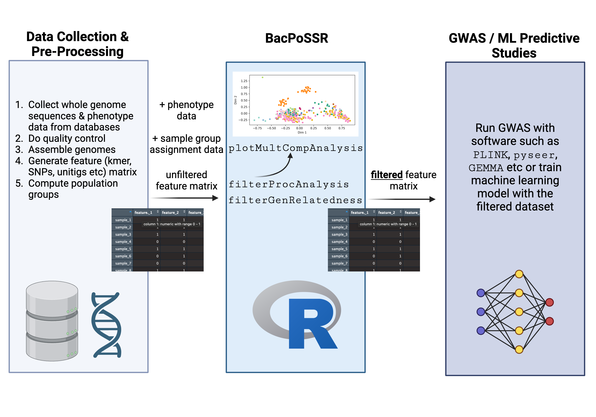

<!-- README.md is generated from README.Rmd. -->

```{r, include = FALSE}
knitr::opts_chunk$set(
  collapse = TRUE,
  comment = "#>",
  fig.path = "man/figures/README-",
  out.width = "100%"
)
```
# BacPoSSR
Filtering Tool to Reduce Population Structure Signal in Bacterial Genotype-Phenotype Analysis Data

## Description

`BacPoSSR` (Bacterial Population Structure Signal Reducer) is a tool to help users filter their single nucleotide polymorphism (SNP) or k-mer data to reduce population structure signal in the dataset before it is used in bacterial genotype-phenotype association or predictive studies. It aims to improve the flow of these studies, especially methods that use machine learning models to compute these mappings because scientists must build in their own methods to account for population structure within their models, unlike more established genome-wide association studies (GWAS) tools such as pyseer (Lees et al., 2018). When population structure is not accounted for, association/predictive studies can easily lead to false positives by inferring phenotypes from population structure (Karlsen et al., 2023).

This package was developed in the following environment:
<br>
R Version: 4.4.1 (2024-06-14) -- "Race for Your Life"
<br>
Platform: macOS Sonoma 14.4

## Installation

To install the latest version of the package:
``` r
install.packages("devtools")
library("devtools")
devtools::install_github("izumiando/BacPoSSR", build_vignettes = TRUE)
library("BacPoSSR")
```
To run the Shiny app:
``` r
runBacPoSSR()
``` 


## Overview

``` r
ls("package:BacPoSSR") # lists the functions in BacPoSSR
data(package = "BacPoSSR") # view sample dataset
browseVignettes("BacPoSSR") # view all vignettes
```
`BacPoSSR` contains 3 functions. For further details on how to use each function, please refer to the vignette and help documentation.
<br>
<br>
- _plotMultCompAnalysis_ : use this function to conduct Multiple Component Analysis and plots its results to examine the population structure signal of your dataset.
<br>
- _filterProcAnalysis_ : use this function to filter your feature matrix using Procrustes Analysis.
<br>
- _filterGenRelatedness_ : use this function to filter your feature matrix based on the features' genetic relatedness. Using SNPs data is recommended for this function.
<br>
<br>
BacPoSSR can be contextualized in the GWAS / ML predictive studies pipeline as illustrated in the image below.




## Contributions

The author of BacPoSSR is Izumi Ando. BacPoSSR contains three functions, all of which were written by the author while making use of functions from third-party R packages.
The _plotMultCompAnalysis_ function formats the input data (feature matrix and group assignments) and utilizes the _MCA_ function from the `FactoMineR` package to conduct Multiple Component Analysis, the _fviz_mca_ind_ function from the `factoextra` package to plot the results, and _ggsave_ from the `ggplot2` package to save the image. 
The _filterProcAnalysis_ function filters the input feature matrix based on the Procrustes distances of each feature, computed by conducting the analysis on the features against the phenotype data. The function utilizes the _procrustes_ function from the `vegan` package to conduct the Procrustes Analysis. The code to computate of the distances and to do the actual filtering was written by the author.
The _filterGenRelatedness_ function filters the input feature matrix based on the features' genetic relatedness. This function does not rely on any third party packages.
ChatGPT developed by OpenAI was used in the creation of this package only for the purpose of debugging the code.

## References

- Chang W, Cheng J, Allaire J, Sievert C, Schloerke B, Xie Y, Allen J, McPherson J, Dipert A, Borges B (2024). _shiny: Web Application Framework for R_. R package version 1.9.1, <https://CRAN.R-project.org/package=shiny>.

- Karlsen, S. T., Rau, M. H., Sánchez, B. J., Jensen, K., & Zeidan, A. A. (2023). From genotype to phenotype: Computational approaches for inferring microbial traits relevant to the food industry. FEMS Microbiology Reviews, 47(4), fuad030. https://doi.org/10.1093/femsre/fuad030

- Lê S, Josse J, Husson F (2008). “FactoMineR: A Package for Multivariate Analysis.” Journal of Statistical Software, 25(1), 1–18. doi:10.18637/jss.v025.i01.

- Lees, J. A., Galardini, M., Bentley, S. D., Weiser, J. N., & Corander, J. (2018). pyseer: A comprehensive tool for microbial pangenome-wide association studies. Bioinformatics, 34(24), 4310–4312. https://doi.org/10.1093/bioinformatics/bty539

- Oksanen J, Simpson G, Blanchet F, Kindt R, Legendre P, Minchin P, O'Hara R, Solymos P, Stevens M, Szoecs E, Wagner H, Barbour M, Bedward M, Bolker B, Borcard D, Carvalho G, Chirico M, De Caceres M, Durand S, Evangelista H, FitzJohn R, Friendly M, Furneaux B, Hannigan G, Hill M, Lahti L, McGlinn D, Ouellette M, Ribeiro Cunha E, Smith T, Stier A, Ter Braak C, Weedon J (2024). _vegan: Community Ecology Package_. R package version 2.6-8, <https://CRAN.R-project.org/package=vegan>.

- R Core Team (2024). _R: A Language and Environment for Statistical Computing_. R Foundation for Statistical Computing, Vienna, Austria. <https://www.R-project.org/>.

- Sievert C, Cheng J, Aden-Buie G (2024). _bslib: Custom 'Bootstrap' 'Sass' Themes for 'shiny' and 'rmarkdown'_. R package version 0.8.0, <https://CRAN.R-project.org/package=bslib>.

- Wickham H (2016). ggplot2: Elegant Graphics for Data Analysis. Springer-Verlag New York. ISBN 978-3-319-24277-4, https://ggplot2.tidyverse.org.

## Acknowledgements

This package was developed as a part of an assessment for 2024 BCB410H: Applied Bioinformatics course at the University of Toronto, Toronto, CANADA. BacPoSSR welcomes issues, enhancement requests, and other contributions. To submit an issue, use GitHub issues.
